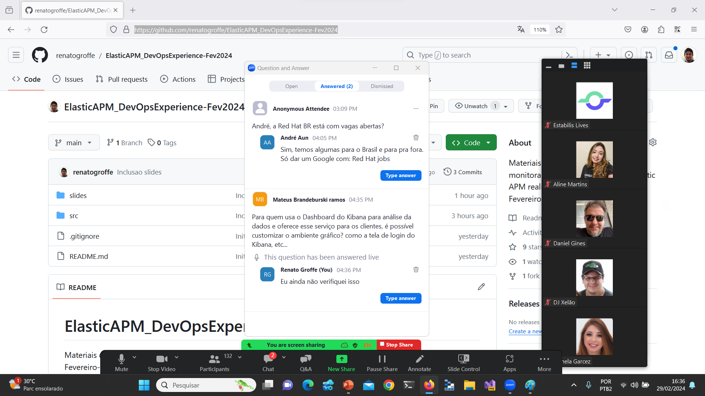

# ElasticAPM_DevOpsExperience-Fev2024
Materiais de apresentação sobre monitoramento de aplicações com Elastic APM realizada durante a edição de Fevereiro-2024 do DevOps Experience.

Título da Apresentação: **Monitoramento Eficiente de Aplicações com Elastic APM**

Data: **29/02/2024 (quarta-feira)**

Tipo do evento: **Online**

Ferramenta de transmissão: **Zoom**

Tecnologias utilizadas: **.NET 8, ASP.NET Core, Elasticsearch, Elastic APM, Kibana, Redis, PostgreSQL, Entity Framework Core, Docker, Docker Compose**

Número de participantes: **142 pessoas (pico de audiência ao longo da live)**

Link do evento: [**Instagram**](https://www.instagram.com/p/C3tKQoGuBGl/?img_index=1)

Deixo aqui meus agradecimentos ao **Daniel Ginês** e à **Aline Martins** por todo o apoio para que eu partipasse como palestrante de mais uma edição do **DevOps Experience**.

---

